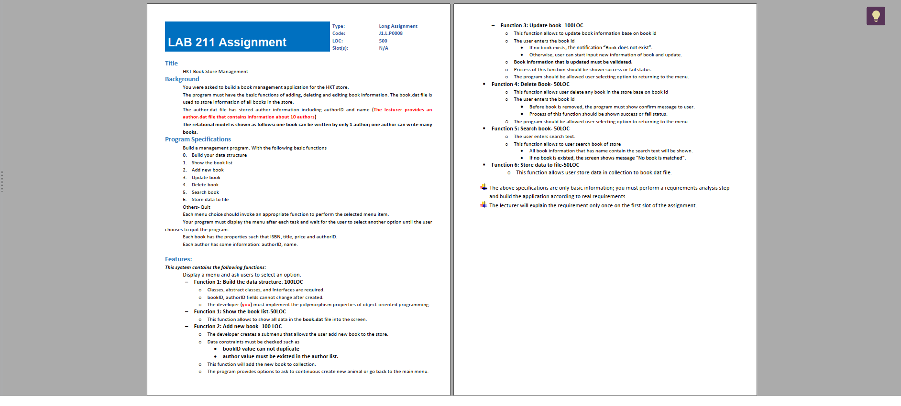

# Manage BookStore using Java OOP

## 2 of 3

### Project description:

I used 2 kind of List to manage, TreeSet for Book, ArrayList for Author

Feature **Add new Book** in this project will not work if user add new book 

Type wrong name or none exist Author in Author List.

### Requirement :

